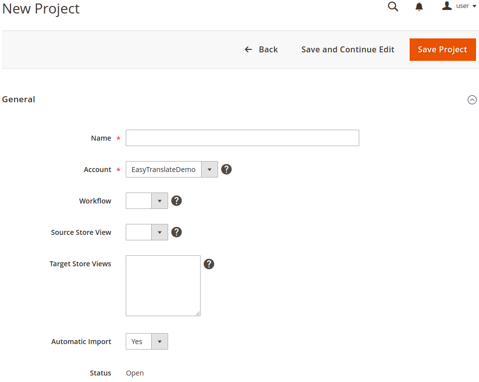

# EasyTranslate Connector For Magento 2

This Magento 2 extension integrates EasyTranslate into Magento 2.

Mind that you need to have an account with EasyTranslate on Language-as-a-Service. Please send an e-mail to
info@easytranslate.com to learn more.

## Description

This Magento 2 extension integrates EasyTranslate into Magento 2. It enables you to translate products, categories, CMS
blocks and CMS pages via EasyTranslate.

## Workflow

The following diagram gives a rough overview of the workflow:

### Initial Configuration

Go to Stores > Configuration > Services > EasyTranslate Connector:

First, insert the API credentials you either get from the EasyTranslate support or from
your [EasyTranslate Account](https://platform.easytranslate.com/) under Settings >
API. Then, for each entity, you can decide which attributes should be translated via EasyTranslate. Save your
configuration.

Make sure that the default Magento cronjob is configured and runs correctly. To check
this, [EthanYehuda_CronjobManager](https://github.com/Ethan3600/magento2-CronjobManager) might come in handy.

### Create Projects / Access Existing Projects

Go to System > EasyTranslate Projects. Click the "Add Project" button in the upper right corner. Add the basic project
information and click "Save and Continue Edit".
In this step you can also decide, if the translations shall be automatically imported or only on manual scheduling.

### Add Content To Project

Open the project from System > EasyTranslate Projects. Click on the entity type you want to add.
Then, change the filter to "Any", search for the entities you want to add and select the checkbox. Then, save the
project.

### Send Project To EasyTranslate

As soon as you are finished with adding content to your project, you can send it to EasyTranslate using the "Send To
EasyTranslate" button in the project view.

### Accept / Decline Price [optional]

If the estimated price for the project is above your configured threshold at EasyTranslate, you have the possibility to
accept or decline the price inside of Magento. As soon as the price is available and above your personal threshold, you
will see respective buttons in the project view:

### Import of Translated Content

If the estimated price for the project is below your threshold, or you accepted the price, the content will be
translated. As soon as the translations are available, EasyTranslate will notify your shop about it. When your default
Magento cronjob is configured correctly, and you activated automatic import, translations will then be automatically
imported after a few hours.

### Schedule Import [optional]

If automatic import is disabled, the button "Schedule for import" appears in the project view. 
A click on this button activates the import, so the translations will be included within the next hours.

## Compatibility

This extension is compatible with the latest supported versions of Magento 2.3 and Magento 2.4.

It may also be compatible with older versions, but we strongly recommend to only use up-to-date versions of Magento 2.

## Installation Instructions

The installation procedure highly depends on your setup. In any case, you should use a version control system like git
and test the installation on a development system.

### Composer Installation

1. `composer require easytranslate/m2-connector`
2. `bin/magento module:enable EasyTranslate_Connector`
3. `bin/magento setup:upgrade`
4. `bin/magento setup:di:compile`
5. `bin/magento cache:flush`

### Manual Installation

1. Unzip the downloaded files.
2. Create the directory `app/code/EasyTranslate/Connector/`: `mkdir -p app/code/EasyTranslate/Connector/`
3. Copy the contents of the `src` directory from the unzipped files to the newly created directory `app/code/EasyTranslate/Connector/`.
4. `bin/magento module:enable EasyTranslate_Connector`
5. `bin/magento setup:upgrade`
6. `bin/magento setup:di:compile`
7. `bin/magento cache:flush`

## Uninstallation

The uninstallation procedure depends on your setup:

### Uninstallation After Composer Installation

1. `bin/magento module:uninstall EasyTranslate_Connector`
2. `bin/magento setup:di:compile`
3. `bin/magento cache:flush`

### Uninstallation After Manual Installation

1. `bin/magento module:disable EasyTranslate_Connector`
2. `bin/magento setup:di:compile`
3. `bin/magento cache:flush`
4. `rm -r app/code/EasyTranslate/Connector/`

## Support

If you have any issues with this extension, feel free to open an issue
on [GitHub](https://github.com/easytranslate-com/laas-api-magento-2-plugin/issues).

## Licence

[Open Software License 3.0](https://opensource.org/licenses/OSL-3.0)

## Copyright

&copy; 2021 EasyTranslate A/S
